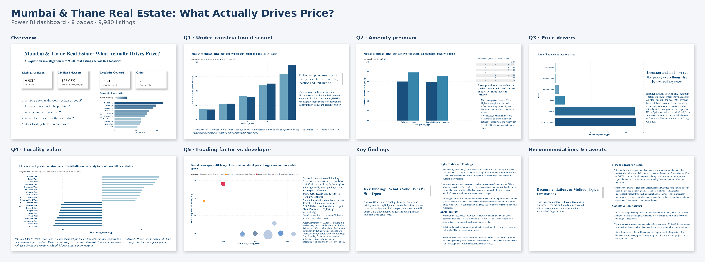

# Mumbai & Thane Real Estate: What Actually Drives Price?

A 5-question investigation into 9,980 real property listings across 82+ localities — answering what actually moves price per square foot in this market, and what doesn't.

[Learn more ↓](#scenario)

---

## Dashboard

The full interactive Power BI file — [`mumbai-real-estate-analysis.pbix`](mumbai-real-estate-analysis.pbix) — is available in this repo. Requires Power BI Desktop to open.

---

**Project Name:** Mumbai & Thane Real Estate: What Actually Drives Price?
**Project Type:** Data Analytics / BI Case Study
**Tools Used:** Python (pandas, scikit-learn), SQL (DuckDB), Power BI Desktop

## Scenario

- Analyzed 12,685 real property listings scraped from an online property portal (Kaggle: Real Estate Properties Dataset — Mumbai)
- Investigated five specific business questions spanning pricing psychology, amenity value, locality economics, and one architecture-informed question no generic analyst template would think to ask
- Goal: produce findings a buyer, developer, or real estate platform could actually act on — not just a dashboard of charts

## Summary

- After cleaning, 9,980 listings across Mumbai and Thane were analyzed (21% of raw rows removed — out-of-scope listings such as rentals and other cities, plus data-quality failures, each against a documented threshold)
- **No consistent "under-construction discount" exists** once locality and bedroom count are properly controlled for
- **The amenity bundle premium is real** — ~13-15% higher price/sqft — but smaller than the naive ~23% comparison first suggested
- **Location (45%) and unit size (46%) together account for over 90% of the price model's explanatory power** (the model explains 51% of price variation overall); possession status, floor, furnishing, and amenities matter far less by comparison
- **Outer-suburb localities** (Virar, Nalasopara) offer the best "value for money" by bedroom/amenity tier — but this explicitly ignores commute time, a major caveat
- **Two premium developers** (Oberoi Realty, K Raheja Corp) charge a real, measurable premium despite below-average space efficiency (measured here as carpet ÷ covered area — lower means less usable space per sqft paid for)

## Key Challenges & Solutions

- **Challenge:** Raw data contained extreme outliers (a listing priced at ₹4,080 Cr), ~30 stray rows from cities outside Mumbai/Thane, and 85 physically impossible rows where carpet area exceeded covered area
- **Solution:** Built a systematic Python cleaning pipeline with explicit, documented sanity-check thresholds for every field, rather than trusting the raw data or silently dropping rows
- **Challenge:** A naive possession-status-vs-price comparison suggested a large effect, but it turned out to be driven entirely by a locality confound — certain premium under-construction towers were skewing the citywide average
- **Solution:** Re-ran every comparison controlling for both locality AND bedroom count using matched-pair SQL queries, which reversed or nullified several apparent findings before they could be reported as real
- **Challenge:** The Random Forest driver-importance model initially appeared to contradict the amenity-premium finding from Question 2
- **Solution:** Investigated and explained the discrepancy directly rather than hiding it — a controlled marginal effect and a model's predictive-importance ranking are different questions, and can legitimately disagree once locality is already accounted for in the model

## What I Learned

- Naive, uncontrolled comparisons routinely hide confounding variables — nearly every "obvious" finding in this analysis needed a second, controlled pass before it could be trusted
- Learned to distinguish a metric's *marginal effect* (a controlled comparison) from its *predictive importance* (feature importance in a multivariate model) — these answer different questions and can disagree without either being wrong
- Domain knowledge from an architecture background surfaced a genuinely original question (loading factor) that a purely data-trained analyst likely wouldn't have thought to check
- Learned to be explicit about a finding's audience — "good for buyers" and "good for developers" are often different, sometimes opposing, conclusions drawn from the exact same data

## Why It Matters

- Real estate pricing is full of intuitive-sounding claims — under-construction is cheaper, amenities are worth it, a trusted brand guarantees quality — that don't all survive scrutiny
- This analysis shows which of those claims hold up statistically and which don't, with the confidence level made explicit rather than every finding presented with equal certainty
- The loading-factor finding specifically surfaces a real, consumer-relevant gap: brand reputation is not a reliable signal of space efficiency in this market
- This kind of controlled, confound-aware analysis — catching your own false positives before reporting them — is what separates decision-useful analytics from a dashboard of surface-level charts

## Recommendations

**High-Confidence Findings**
- The amenity premium (Club House + Pool + Gym as one bundle) is real, not just marketing — ~13-15% higher price/sqft even after controlling for locality and bedroom count
- Location and unit size (bedroom + bathroom combined) account for over 90% of what the price model can explain (R²=0.51) — possession status barely moves the needle once locality and bedroom count are controlled for
- Loading factor isn't priced into the market broadly, but two premium developers (Oberoi Realty, K Raheja Corp) charge a real premium despite below-average space efficiency — a concrete due-diligence flag for buyers regardless of brand reputation

**Worth Testing**
- Whether the "best value" outer-suburb localities remain good value once commute time and job-center proximity are factored in
- Whether the loading-factor-vs-brand pattern holds in other cities, or is specific to Mumbai/Thane's premium segment
- Whether furnishing status and transaction type (resale vs. new booking) move price independently once locality is controlled for — scoped out of this analysis rather than tested

## How to Measure Success

- Re-run the amenity-premium check periodically as new supply enters the market — if the ~13-15% premium shrinks over time, that signals the market correcting toward treating these amenities as standard rather than premium
- For buyers: always request both Carpet Area and Covered Area directly from the developer, and calculate loading factor independently rather than trusting brochures — especially with brand-name developers, since this analysis found that reputation doesn't guarantee space efficiency
- For a real estate platform: consider surfacing loading factor as a searchable or filterable field, since it materially affects what a buyer gets for their money but isn't priced in by the market — carpet area is disclosed under RERA, but the carpet-to-covered ratio is rarely surfaced as a comparison field

## Caveats & Limitations

- Based on scraped asking prices, not confirmed transactions, with 21% of rows removed during cleaning — the remaining 9,980 listings may not fully represent the original population
- The price-driver model explains only 51% of variation (R²=0.51) — the rest comes from factors this dataset can't capture, like exact view, condition, or negotiation
- Amenities are recorded as binary, and developer-level findings reflect this dataset's snapshot only — patterns may not generalize across other projects, other cities, or over time

---

## Repository Contents

- `README.md` — this file
- `mumbai-real-estate-analysis.pbix` — full interactive Power BI dashboard (8 pages)
- `analysis_pipeline.py` — the complete Python cleaning and modeling pipeline (data cleaning, feature engineering, Random Forest driver analysis, locality residual analysis, loading factor analysis)
- `queries/` — SQL queries (DuckDB) used to answer Questions 1, 2, 4, and 5 with locality- and bedroom-controlled comparisons
- `assets/` — dashboard screenshot(s) referenced in this README
